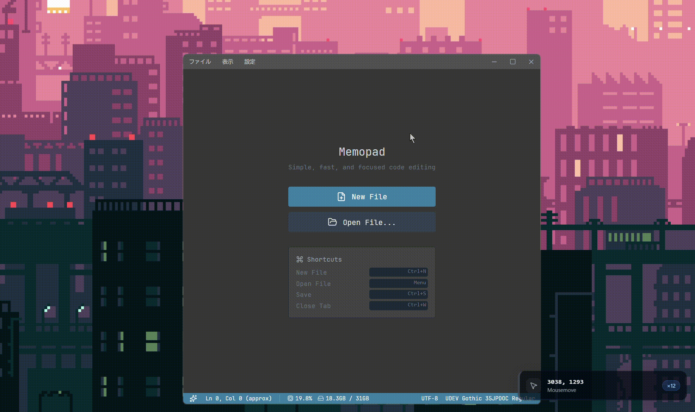

# EchoCast

EchoCast is a lightweight, privacy-focused input visualization tool designed for screen recording, tutorials, and presentations. It displays your keystrokes and mouse clicks in a minimal overlay, helping your audience follow along seamlessly.


## Features

- **Real-time Input Overlay**: clearly displays keyboard shortcuts and mouse actions.
- **Smart Key Resolution**: Automatically detects keyboard layout (JIS/US) via OS events.
- **Typewriter Mode**: Shows typed text naturally while highlighting shortcuts (e.g., `Ctrl+C`).
- **Minimalist Design**: Unobtrusive UI that floats above your content.
- **Privacy First**: No keylogging storage; data is transient and visualized locally.
- **Cross-Platform**: Optimized for Windows with Tauri (Rust + React).

## Installation & Usage

1. Download the latest release (or build from source).
2. Run `echocast.exe`.
3. The overlay will appear at the bottom-right (configurable).
4. Start recording your screen!

## Demo



## Architecture

Built with:
- **Tauri v2**: For a tiny footprint and high performance.
- **Rust**: Handling low-level input hooks safely.
- **React + Tailwind**: For a beautiful, responsive overlay UI.

## Development & Build

### Prerequisites

**Node.js** (v18+) and **Rust** (latest stable) are required.

- **Windows**: Install [Build Tools for Visual Studio](https://visualstudio.microsoft.com/visual-cpp-build-tools/) and select the "Desktop development with C++" workload.
- **macOS**: Run `xcode-select --install` to install Xcode Command Line Tools.
- **Linux (Debian/Ubuntu)**: Install dependencies using the following command:
  ```bash
  sudo apt update
  sudo apt install libwebkit2gtk-4.1-dev build-essential curl wget file libssl-dev libgtk-3-dev libayatana-appindicator3-dev librsvg2-dev
  ```

### Commands

Run these commands from the project root directory.

1. **Install Dependencies**
   ```bash
   npm install
   ```

2. **Start Development Server** (with Hot Reload)
   ```bash
   npm run tauri dev
   ```

3. **Production Build**
   Generates optimized binaries and installers for your OS.
   ```bash
   npm run tauri build
   ```
   
   **Output:**
   - **Windows**: 
     - Installer: `src-tauri/target/release/bundle/nsis/*.exe`
     - Portable: `src-tauri/target/release/echocast.exe`
   - **macOS**: `src-tauri/target/release/bundle/dmg/*.dmg`
   - **Linux**: `src-tauri/target/release/bundle/deb/*.deb`

---
*Created for efficient communication.*
